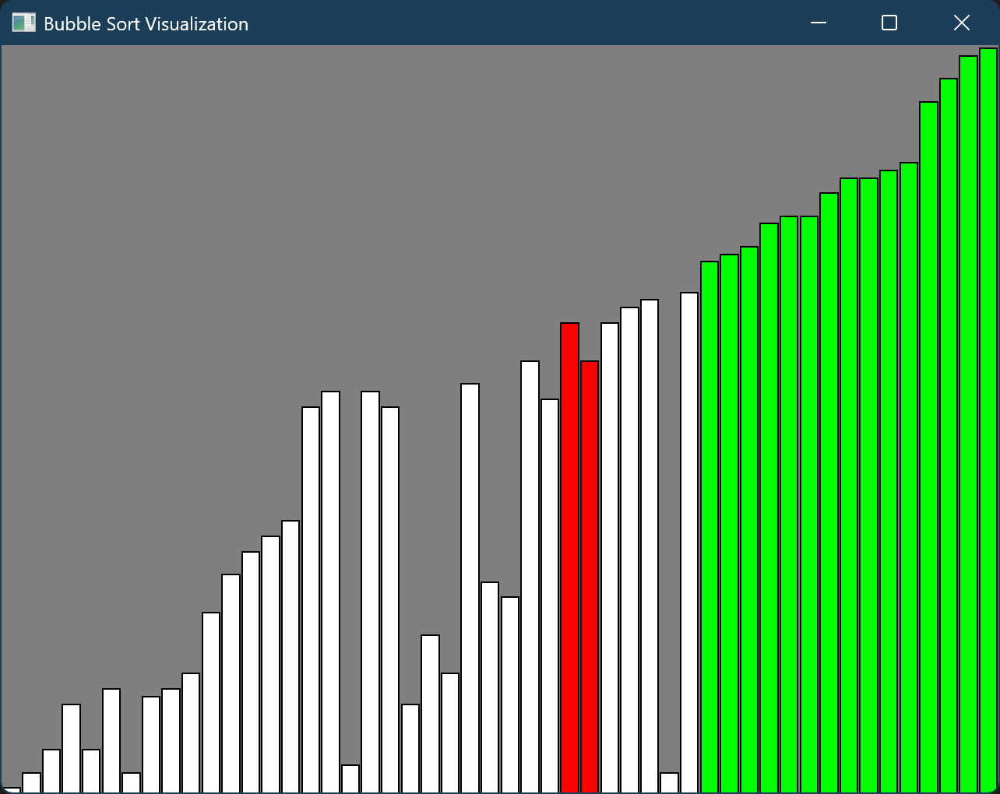

# Sorting Algorithm Visualization

This project is written in C++, with SFML library.

## Platform

Windows is recommended. Other operating systems are not tested.

## Usage

Build with CMake.

## Known Issues

- sf::View messed up after fullscreen

## Finished Algorithms

- Bubble Sort

## TODO

- Improve UI
- Let user decide array, array length, and so on
- Other algorithms
- ...

## Contribution

None

---
## Any Contribution Is Appreciated!
